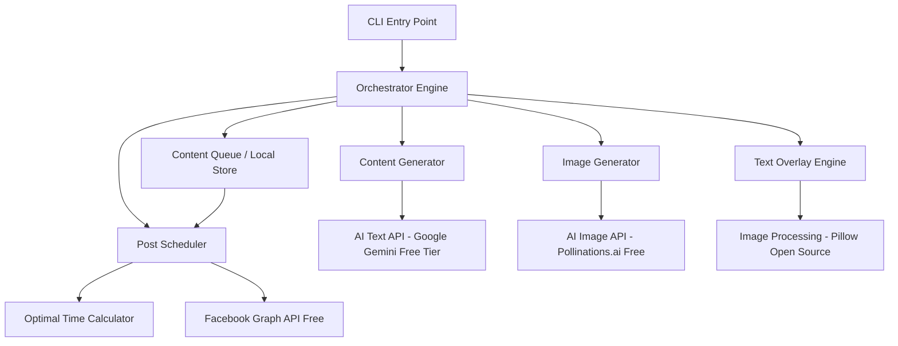
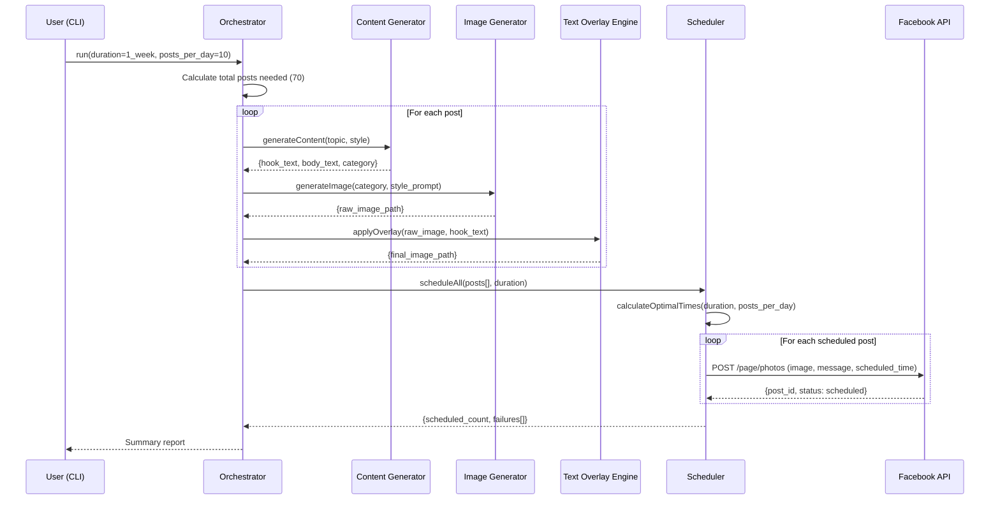
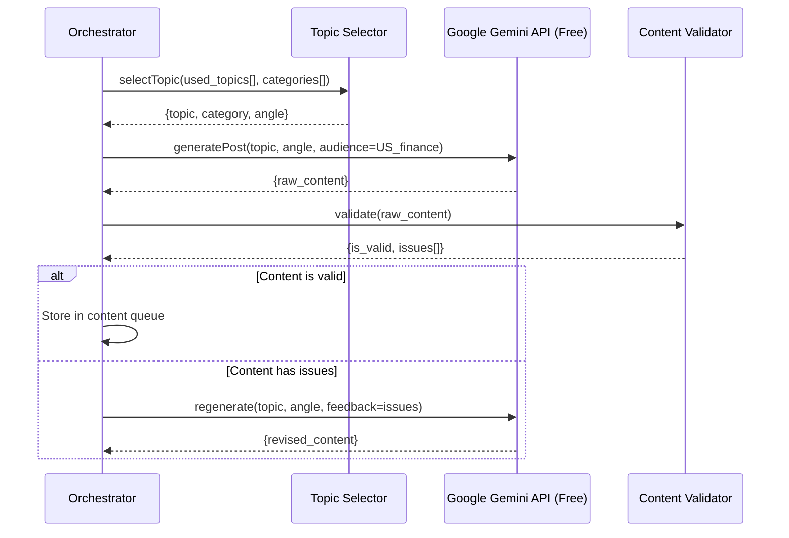

# Design Document: Facebook Finance Auto-Poster

## Overview

The Facebook Finance Auto-Poster is an automated content pipeline that generates, designs, and schedules finance-related posts to Facebook pages — **entirely for free**. The system leverages free-tier AI services for both text content generation (Google Gemini free tier for engaging hooks and educational finance content tailored for US audiences) and image generation (Pollinations.ai — completely free, no API key needed). It supports bulk scheduling — allowing a single script execution to schedule an entire week or month of content (8-10 posts daily) at optimal engagement times for US-based audiences.

The system is designed as a CLI-driven automation tool that orchestrates multiple free AI services (Google Gemini for text, Pollinations.ai for images), an image processing pipeline (Pillow — open-source) for text overlay composition, and the Facebook Graph API (free) for post scheduling. The architecture prioritizes reliability, content variety, and compliance with Facebook's rate limits and content policies — all at **zero cost**.

## Cost Summary

| Service | Purpose | Cost |
|---------|---------|------|
| Google Gemini API | Text content generation | **FREE** (15 RPM, 1M tokens/day) |
| Pollinations.ai | Image generation | **FREE** (no API key, unlimited) |
| Facebook Graph API v18+ | Post scheduling | **FREE** |
| Pillow (PIL) | Image processing & text overlay | **FREE** (open-source) |
| **Total** | | **$0/month** |

## Architecture




## Sequence Diagrams

### Main Workflow: Bulk Content Generation & Scheduling




### Content Generation Flow



## Components and Interfaces

### Component 1: CLI Entry Point

**Purpose**: Provides the user interface for configuring and triggering bulk content generation and scheduling runs.

**Interface**:
```pascal
INTERFACE CLIHandler
  PROCEDURE run(config: RunConfig): RunResult
  PROCEDURE preview(count: Integer): PreviewResult
  PROCEDURE status(): ScheduleStatus
  PROCEDURE cancel(post_ids: List[String]): CancelResult
END INTERFACE
```

**Responsibilities**:
- Parse command-line arguments (duration, posts per day, dry-run mode)
- Validate configuration and API credentials (Gemini key, Facebook token)
- Display progress and summary reports
- Support preview mode (generate without scheduling)


### Component 2: Content Generator

**Purpose**: Generates engaging finance-related text content using Google Gemini free tier, ensuring variety and audience relevance.

**Interface**:
```pascal
INTERFACE ContentGenerator
  PROCEDURE generatePost(topic: Topic, style: ContentStyle): PostContent
  PROCEDURE generateHook(topic: Topic): HookText
  PROCEDURE selectTopic(history: List[Topic], categories: List[Category]): Topic
  PROCEDURE validateContent(content: PostContent): ValidationResult
END INTERFACE
```

**Responsibilities**:
- Generate diverse finance content (tips, news commentary, educational posts, motivational) using Google Gemini
- Ensure no topic repetition within a configurable window
- Create attention-grabbing hooks suitable for image overlay
- Validate content for compliance (no financial advice disclaimers needed, no misleading claims)
- Fallback to Groq free tier if Gemini rate limit is hit

### Component 3: Image Generator

**Purpose**: Creates high-engagement finance-themed images using Pollinations.ai (completely free, no API key required).

**Interface**:
```pascal
INTERFACE ImageGenerator
  PROCEDURE generateImage(category: Category, style: ImageStyle): ImageResult
  PROCEDURE buildPrompt(category: Category, style: ImageStyle): String
  PROCEDURE downloadAndStore(url: String, filename: String): FilePath
END INTERFACE
```

**Responsibilities**:
- Build effective prompts for finance-themed imagery
- Generate images at appropriate dimensions for Facebook (1200x630 or 1080x1080) via Pollinations.ai URL API
- Handle timeout and retry logic (Pollinations.ai has no rate limits but may have latency)
- Store generated images locally for processing


### Component 4: Text Overlay Engine

**Purpose**: Composites hook text onto generated images with attractive styling, ensuring readability and visual appeal. Uses Pillow (PIL) — free and open-source.

**Interface**:
```pascal
INTERFACE TextOverlayEngine
  PROCEDURE applyOverlay(image_path: FilePath, hook_text: String, style: OverlayStyle): FilePath
  PROCEDURE calculateLayout(image_dimensions: Dimensions, text: String): LayoutResult
  PROCEDURE selectFont(style: OverlayStyle): FontConfig
END INTERFACE
```

**Responsibilities**:
- Render text over images with proper contrast (dark overlay/shadow behind text)
- Auto-size text to fit within safe zones
- Support multiple overlay styles (top banner, center overlay, bottom caption)
- Maintain brand consistency across posts

### Component 5: Post Scheduler

**Purpose**: Calculates optimal posting times for US audiences and schedules posts via the Facebook Graph API (free).

**Interface**:
```pascal
INTERFACE PostScheduler
  PROCEDURE scheduleAll(posts: List[SchedulablePost], config: ScheduleConfig): ScheduleResult
  PROCEDURE calculateOptimalTimes(start_date: Date, end_date: Date, posts_per_day: Integer): List[DateTime]
  PROCEDURE publishToFacebook(post: SchedulablePost, scheduled_time: DateTime): PublishResult
  PROCEDURE checkRateLimits(): RateLimitStatus
END INTERFACE
```

**Responsibilities**:
- Calculate best posting times for US audience engagement (EST/PST prime hours)
- Spread posts evenly throughout the day with variety in timing
- Handle Facebook API rate limits (respect 200 calls/hour limit)
- Retry failed scheduling attempts with exponential backoff
- Track scheduled post IDs for status monitoring


## Data Models

### Model 1: RunConfig

```pascal
STRUCTURE RunConfig
  duration: Duration          // ONE_WEEK or ONE_MONTH
  posts_per_day: Integer      // 8-10 (default: 10)
  page_id: String             // Facebook Page ID (free)
  access_token: String        // Facebook Page Access Token (free)
  gemini_api_key: String      // Google Gemini API Key (FREE from https://aistudio.google.com)
  dry_run: Boolean            // Generate without scheduling
  output_dir: FilePath        // Directory for generated content
  content_categories: List[Category]  // Enabled content categories
END STRUCTURE
```

**Validation Rules**:
- posts_per_day must be between 1 and 15
- duration must be ONE_WEEK or ONE_MONTH
- access_token must be a valid Facebook page token with pages_manage_posts and pages_read_engagement permissions
- gemini_api_key must be a valid Google AI Studio key (free to obtain)
- output_dir must be writable

### Model 2: PostContent

```pascal
STRUCTURE PostContent
  id: UUID
  hook_text: String           // Short text for image overlay (max 60 chars)
  body_text: String           // Full post caption (max 500 chars)
  category: Category          // TIPS, NEWS_COMMENTARY, EDUCATIONAL, MOTIVATIONAL, STATS_FACTS, COMPARISON, MYTH_BUSTING
  topic: String               // Specific topic within category
  hashtags: List[String]      // Relevant hashtags (max 5)
  created_at: DateTime
END STRUCTURE
```

**Validation Rules**:
- hook_text must be 10-60 characters
- body_text must be 50-500 characters
- hashtags limited to 5 maximum
- category must be a valid Category enum value


### Model 3: SchedulablePost

```pascal
STRUCTURE SchedulablePost
  id: UUID
  content: PostContent
  image_path: FilePath        // Path to final image with overlay
  scheduled_time: DateTime    // When to publish (must be future)
  status: PostStatus          // PENDING, SCHEDULED, PUBLISHED, FAILED
  facebook_post_id: String    // Assigned after scheduling (nullable)
  retry_count: Integer        // Number of scheduling retries
END STRUCTURE
```

**Validation Rules**:
- scheduled_time must be in the future (at least 10 minutes ahead)
- scheduled_time must be within 75 days (Facebook limit)
- image_path must point to an existing file
- image file must be JPEG or PNG, under 10MB


### Model 4: ScheduleConfig

```pascal
STRUCTURE ScheduleConfig
  start_date: Date            // First day of scheduling
  end_date: Date              // Last day of scheduling
  posts_per_day: Integer      // Posts per day (8-10)
  timezone: String            // Target timezone (default: America/New_York)
  prime_hours: List[TimeRange]  // Peak engagement windows
  avoid_hours: List[TimeRange]  // Hours to avoid posting
END STRUCTURE
```

### Model 5: Category Enum

```pascal
ENUMERATION Category
  TIPS                // Financial tips and hacks
  NEWS_COMMENTARY     // Commentary on financial news/markets
  EDUCATIONAL         // Educational content about investing, saving, budgeting
  MOTIVATIONAL        // Wealth-building motivation and mindset
  STATS_FACTS         // Interesting financial statistics and facts
  COMPARISON          // Product/strategy comparisons
  MYTH_BUSTING        // Common financial myths debunked
END ENUMERATION
```


## Algorithmic Pseudocode

### Main Orchestration Algorithm

```pascal
ALGORITHM orchestrateBulkGeneration(config)
INPUT: config of type RunConfig
OUTPUT: result of type RunResult

BEGIN
  ASSERT config.posts_per_day >= 1 AND config.posts_per_day <= 15
  ASSERT config.duration IN {ONE_WEEK, ONE_MONTH}
  
  // Step 1: Calculate total posts needed
  total_days ← daysInDuration(config.duration)
  total_posts ← total_days * config.posts_per_day
  
  // Step 2: Generate content for all posts
  posts ← EMPTY LIST
  used_topics ← EMPTY SET
  
  FOR i FROM 1 TO total_posts DO
    ASSERT length(posts) = i - 1  // Loop invariant: posts grows by 1 each iteration
    
    // Select unique topic
    topic ← selectUniqueTopic(used_topics, config.content_categories)
    used_topics.add(topic)
    
    // Generate text content via Google Gemini (free tier)
    content ← generatePostContent(topic)
    
    // Generate image via Pollinations.ai (free, no API key)
    raw_image ← generateFinanceImage(content.category)
    
    // Apply text overlay via Pillow (free, open-source)
    final_image ← applyTextOverlay(raw_image, content.hook_text)
    
    // Create schedulable post
    post ← CREATE SchedulablePost(content, final_image)
    posts.append(post)
    
    // Rate limiting pause for Gemini free tier (15 RPM)
    IF i MOD 14 = 0 THEN
      WAIT(60 seconds)  // Respect Gemini free tier rate limit
    END IF
  END FOR
  
  ASSERT length(posts) = total_posts
  
  // Step 3: Calculate optimal times and assign
  schedule_times ← calculateOptimalTimes(config.start_date, total_days, config.posts_per_day)
  
  FOR i FROM 0 TO length(posts) - 1 DO
    posts[i].scheduled_time ← schedule_times[i]
  END FOR
  
  // Step 4: Schedule via Facebook API (unless dry run)
  IF NOT config.dry_run THEN
    result ← scheduleToFacebook(posts, config.page_id, config.access_token)
  ELSE
    result ← CREATE RunResult(posts, scheduled=0, dry_run=TRUE)
  END IF
  
  RETURN result
END
```

**Preconditions:**
- config is validated and all API keys are present
- Gemini API key is valid (free from Google AI Studio)
- Facebook page token has pages_manage_posts and pages_read_engagement permissions
- Network connectivity available for API calls

**Postconditions:**
- All posts are either scheduled or marked as failed with retry info
- Generated images are stored in output_dir
- A manifest file is written with all post details and scheduled times

**Loop Invariants:**
- posts list grows by exactly 1 per iteration
- used_topics contains all topics used so far (ensures no repeats)
- Each post has valid content, image, and overlay before being added


### Optimal Time Calculation Algorithm

```pascal
ALGORITHM calculateOptimalTimes(start_date, total_days, posts_per_day)
INPUT: start_date of type Date, total_days of type Integer, posts_per_day of type Integer
OUTPUT: times of type List[DateTime]

BEGIN
  // US audience peak engagement hours (EST)
  prime_windows ← [
    {start: 07:00, end: 09:00, weight: 0.8},   // Morning commute
    {start: 11:30, end: 13:30, weight: 1.0},   // Lunch break (highest)
    {start: 17:00, end: 19:00, weight: 0.9},   // After work
    {start: 20:00, end: 22:00, weight: 0.7}    // Evening scroll
  ]
  
  times ← EMPTY LIST
  
  FOR day FROM 0 TO total_days - 1 DO
    current_date ← start_date + day
    day_times ← EMPTY LIST
    
    // Distribute posts across prime windows weighted by engagement
    slots ← distributeAcrossWindows(posts_per_day, prime_windows)
    
    FOR each slot IN slots DO
      // Add randomness within the window (avoid exact same times daily)
      random_offset ← RANDOM(0, slot.window_duration_minutes)
      post_time ← current_date + slot.window_start + random_offset minutes
      day_times.append(post_time)
    END FOR
    
    // Sort times chronologically for the day
    SORT day_times BY time ascending
    
    // Ensure minimum 30-minute gap between posts
    day_times ← enforceMinimumGap(day_times, min_gap=30 minutes)
    
    times.appendAll(day_times)
  END FOR
  
  ASSERT length(times) = total_days * posts_per_day
  RETURN times
END
```

**Preconditions:**
- start_date is today or in the future
- total_days is between 7 and 31
- posts_per_day is between 1 and 15

**Postconditions:**
- All times are in the future
- Minimum 30-minute gap between consecutive posts on same day
- Posts are distributed across US peak engagement windows
- Total number of times equals total_days * posts_per_day

**Loop Invariants:**
- times list grows by exactly posts_per_day per outer iteration
- All times added are chronologically after previously added times


### Content Generation Algorithm

```pascal
ALGORITHM generatePostContent(topic)
INPUT: topic of type Topic
OUTPUT: content of type PostContent

BEGIN
  ASSERT topic IS NOT NULL
  ASSERT topic.category IN Category
  
  // Build the AI prompt based on category and topic
  system_prompt ← buildSystemPrompt(topic.category)
  user_prompt ← buildUserPrompt(topic)
  
  // Call Google Gemini free tier API with structured output
  ai_response ← callGemini(
    system: system_prompt,
    user: user_prompt,
    max_tokens: 300,
    temperature: 0.8,
    model: "gemini-1.5-flash"  // Free tier model
  )
  
  // If Gemini rate limited, fallback to Groq free tier
  IF ai_response.status = RATE_LIMITED THEN
    ai_response ← callGroq(
      system: system_prompt,
      user: user_prompt,
      max_tokens: 300,
      temperature: 0.8,
      model: "llama-3.1-70b-versatile"  // Groq free tier
    )
  END IF
  
  // Parse response into structured content
  content ← parseAIResponse(ai_response)
  
  // Validate hook text length
  IF length(content.hook_text) > 60 THEN
    content.hook_text ← truncateAtWordBoundary(content.hook_text, 60)
  END IF
  
  // Validate body text
  IF length(content.body_text) > 500 THEN
    content.body_text ← truncateAtWordBoundary(content.body_text, 500)
  END IF
  
  // Generate hashtags
  content.hashtags ← generateHashtags(topic.category, topic.name, max=5)
  
  // Final validation
  validation ← validateContent(content)
  IF NOT validation.is_valid THEN
    // Retry with feedback
    content ← regenerateWithFeedback(topic, validation.issues)
  END IF
  
  ASSERT content.hook_text length BETWEEN 10 AND 60
  ASSERT content.body_text length BETWEEN 50 AND 500
  ASSERT length(content.hashtags) <= 5
  
  RETURN content
END
```

**Preconditions:**
- topic is a valid Topic with category and name
- Gemini API key is configured and valid (free from Google AI Studio)
- Network connectivity available

**Postconditions:**
- content has valid hook_text (10-60 chars)
- content has valid body_text (50-500 chars)
- content has at most 5 hashtags
- content.category matches topic.category

**Loop Invariants:** N/A (no loops in this function)


### Image Generation & Overlay Algorithm

```pascal
ALGORITHM generateAndOverlayImage(category, hook_text)
INPUT: category of type Category, hook_text of type String
OUTPUT: final_image_path of type FilePath

BEGIN
  ASSERT category IN Category
  ASSERT length(hook_text) BETWEEN 10 AND 60
  
  // Step 1: Build image generation prompt for Pollinations.ai
  style_keywords ← getStyleKeywords(category)
  prompt ← "Professional finance themed image, " + style_keywords +
            ", modern design, clean composition, " +
            "space for text overlay, high quality, US audience appeal"
  
  // Step 2: Generate image via Pollinations.ai (FREE, no API key needed)
  // Pollinations.ai uses a simple URL-based API
  encoded_prompt ← urlEncode(prompt)
  image_url ← "https://image.pollinations.ai/prompt/" + encoded_prompt + "?width=1200&height=630&nologo=true"
  
  // Step 3: Download and store image from Pollinations.ai
  raw_image_path ← downloadImage(image_url, output_dir, timeout=60)
  ASSERT fileExists(raw_image_path)
  
  // Step 4: Apply text overlay using Pillow (free, open-source)
  overlay_config ← CREATE OverlayStyle(
    position: CENTER,
    font_size: calculateFontSize(hook_text, 1200, 630),
    font_color: WHITE,
    background: SEMI_TRANSPARENT_BLACK,
    padding: 20,
    max_width: 1000  // Leave margins
  )
  
  final_image_path ← applyTextOverlay(raw_image_path, hook_text, overlay_config)
  
  ASSERT fileExists(final_image_path)
  ASSERT fileSize(final_image_path) < 10_MB
  
  RETURN final_image_path
END
```

**Preconditions:**
- category is a valid Category enum value
- hook_text is 10-60 characters
- Network connectivity available (Pollinations.ai requires no API key)
- output_dir exists and is writable

**Postconditions:**
- final_image_path points to an existing file
- Image is JPEG/PNG format, under 10MB
- Image has readable text overlay with proper contrast
- Image dimensions are 1200x630 (Facebook recommended)

**Loop Invariants:** N/A


### Facebook Scheduling Algorithm

```pascal
ALGORITHM scheduleToFacebook(posts, page_id, access_token)
INPUT: posts of type List[SchedulablePost], page_id of type String, access_token of type String
OUTPUT: result of type ScheduleResult

BEGIN
  ASSERT length(posts) > 0
  ASSERT page_id IS NOT EMPTY
  ASSERT access_token IS NOT EMPTY
  
  scheduled_count ← 0
  failures ← EMPTY LIST
  
  FOR each post IN posts DO
    ASSERT post.scheduled_time > NOW() + 10 minutes
    
    retry_count ← 0
    max_retries ← 3
    success ← FALSE
    
    WHILE NOT success AND retry_count < max_retries DO
      TRY
        // Check rate limits before calling
        rate_status ← checkRateLimit(access_token)
        IF rate_status.remaining < 5 THEN
          WAIT(rate_status.reset_time - NOW())
        END IF
        
        // Upload image and schedule post via Facebook Graph API (free)
        response ← facebookAPI.POST(
          endpoint: "/" + page_id + "/photos",
          params: {
            source: post.image_path,
            message: post.content.body_text + "\n\n" + joinHashtags(post.content.hashtags),
            scheduled_publish_time: toUnixTimestamp(post.scheduled_time),
            published: FALSE
          },
          access_token: access_token
        )
        
        post.facebook_post_id ← response.id
        post.status ← SCHEDULED
        scheduled_count ← scheduled_count + 1
        success ← TRUE
        
      CATCH error
        retry_count ← retry_count + 1
        post.retry_count ← retry_count
        
        IF retry_count < max_retries THEN
          WAIT(2^retry_count seconds)  // Exponential backoff
        ELSE
          post.status ← FAILED
          failures.append({post_id: post.id, error: error.message})
        END IF
      END TRY
    END WHILE
    
    // Brief pause between API calls
    WAIT(1 second)
  END FOR
  
  ASSERT scheduled_count + length(failures) = length(posts)
  
  RETURN CREATE ScheduleResult(
    total: length(posts),
    scheduled: scheduled_count,
    failed: length(failures),
    failures: failures
  )
END
```

**Preconditions:**
- All posts have valid content, images, and future scheduled_times
- Facebook access token has required permissions (free to obtain)
- Network connectivity available

**Postconditions:**
- Every post has status of either SCHEDULED or FAILED
- scheduled_count + failures count = total posts
- All scheduled posts have a facebook_post_id assigned
- Failed posts have error details recorded

**Loop Invariants:**
- scheduled_count + length(failures) = number of posts processed so far
- Each post is attempted at most max_retries times


## Key Functions with Formal Specifications

### Function 1: selectUniqueTopic()

```pascal
PROCEDURE selectUniqueTopic(used_topics, categories)
  INPUT: used_topics of type Set[String], categories of type List[Category]
  OUTPUT: topic of type Topic
```

**Preconditions:**
- categories is non-empty
- There exist unused topics in at least one category

**Postconditions:**
- Returned topic is NOT in used_topics set
- Returned topic belongs to one of the provided categories
- Topic selection is weighted toward under-represented categories

**Loop Invariants:** N/A

### Function 2: buildSystemPrompt()

```pascal
PROCEDURE buildSystemPrompt(category)
  INPUT: category of type Category
  OUTPUT: prompt of type String
```

**Preconditions:**
- category is a valid Category enum value

**Postconditions:**
- Returned prompt instructs Gemini to generate finance content for US audience
- Prompt specifies the output format (hook_text + body_text)
- Prompt includes category-specific guidelines
- Prompt length does not exceed 2000 characters

**Loop Invariants:** N/A

### Function 3: applyTextOverlay()

```pascal
PROCEDURE applyTextOverlay(image_path, text, style)
  INPUT: image_path of type FilePath, text of type String, style of type OverlayStyle
  OUTPUT: output_path of type FilePath
```

**Preconditions:**
- image_path points to a valid JPEG or PNG file
- text is non-empty and <= 60 characters
- style contains valid font, color, and position settings

**Postconditions:**
- output_path points to a new image file (original is preserved)
- Text is readable against the background (contrast ratio >= 4.5:1)
- Text fits within the image boundaries with margins
- Output image maintains original dimensions

**Loop Invariants:** N/A

### Function 4: distributeAcrossWindows()

```pascal
PROCEDURE distributeAcrossWindows(posts_per_day, windows)
  INPUT: posts_per_day of type Integer, windows of type List[TimeWindow]
  OUTPUT: slots of type List[TimeSlot]
```

**Preconditions:**
- posts_per_day >= 1
- windows is non-empty and windows don't overlap
- Sum of window weights > 0

**Postconditions:**
- length(slots) = posts_per_day
- Each slot falls within one of the provided windows
- Distribution is proportional to window weights
- No window has more than ceil(posts_per_day * window.weight / total_weight) + 1 posts

**Loop Invariants:**
- Allocated slots sum equals loop iteration count

### Function 5: callGemini()

```pascal
PROCEDURE callGemini(system, user, max_tokens, temperature, model)
  INPUT: system of type String, user of type String, max_tokens of type Integer, temperature of type Float, model of type String
  OUTPUT: response of type AIResponse
```

**Preconditions:**
- GEMINI_API_KEY environment variable is set (free from Google AI Studio)
- model is a valid Gemini model name (e.g., "gemini-1.5-flash")
- Network connectivity available

**Postconditions:**
- response contains generated text OR rate_limit error status
- If successful, response.text is non-empty
- API call respects free tier limits (15 RPM, 1M tokens/day)

**Loop Invariants:** N/A

### Function 6: callPollinations()

```pascal
PROCEDURE callPollinations(prompt, width, height)
  INPUT: prompt of type String, width of type Integer, height of type Integer
  OUTPUT: image_path of type FilePath
```

**Preconditions:**
- prompt is non-empty
- width and height are positive integers
- Network connectivity available (NO API key needed)

**Postconditions:**
- image_path points to a downloaded image file
- Image dimensions match requested width x height
- Image is in JPEG or PNG format

**Loop Invariants:** N/A


## Example Usage

```pascal
// Example 1: Schedule one week of posts (10 per day) — ALL FREE
SEQUENCE
  config ← CREATE RunConfig(
    duration: ONE_WEEK,
    posts_per_day: 10,
    page_id: "123456789",
    access_token: ENV["FB_ACCESS_TOKEN"],
    gemini_api_key: ENV["GEMINI_API_KEY"],
    dry_run: FALSE,
    output_dir: "./output/week_2024_01_15",
    content_categories: [TIPS, EDUCATIONAL, MOTIVATIONAL, STATS_FACTS, MYTH_BUSTING]
  )
  
  result ← orchestrateBulkGeneration(config)
  
  DISPLAY "Scheduled " + result.scheduled + " of " + result.total + " posts"
  DISPLAY "Failures: " + result.failed
  DISPLAY "Total cost: $0 (all services are free!)"
END SEQUENCE

// Example 2: Preview mode (generate without scheduling)
SEQUENCE
  config ← CREATE RunConfig(
    duration: ONE_WEEK,
    posts_per_day: 8,
    dry_run: TRUE,
    output_dir: "./preview/"
  )
  
  result ← orchestrateBulkGeneration(config)
  
  FOR each post IN result.posts DO
    DISPLAY post.content.hook_text
    DISPLAY post.content.body_text
    DISPLAY "Image: " + post.image_path
    DISPLAY "Scheduled for: " + post.scheduled_time
    DISPLAY "---"
  END FOR
END SEQUENCE

// Example 3: Schedule one month of content — STILL FREE
SEQUENCE
  config ← CREATE RunConfig(
    duration: ONE_MONTH,
    posts_per_day: 9,
    page_id: "123456789",
    access_token: ENV["FB_ACCESS_TOKEN"],
    gemini_api_key: ENV["GEMINI_API_KEY"],
    dry_run: FALSE,
    output_dir: "./output/month_2024_02"
  )
  
  // This generates ~270 posts (30 days * 9 posts/day)
  // Cost: $0 — Gemini free tier handles 1M tokens/day, Pollinations.ai is unlimited
  result ← orchestrateBulkGeneration(config)
  
  // Save manifest for tracking
  saveManifest(result, config.output_dir + "/manifest.json")
END SEQUENCE
```


## Correctness Properties

*A property is a characteristic or behavior that should hold true across all valid executions of a system — essentially, a formal statement about what the system should do. Properties serve as the bridge between human-readable specifications and machine-verifiable correctness guarantees.*

### Property 1: Configuration Validation Correctness

*For any* RunConfig object, the CLI validation SHALL accept configurations where posts_per_day is in [1, 15] and duration is ONE_WEEK or ONE_MONTH, and SHALL reject all other configurations with a descriptive error.

**Validates: Requirements 1.1, 1.2, 1.3**

### Property 2: Content Structural Invariants

*For any* PostContent object produced by the Content_Generator (via Google Gemini free tier), the hook_text length SHALL be between 10 and 60 characters, the body_text length SHALL be between 50 and 500 characters, and the hashtag count SHALL be at most 5.

**Validates: Requirements 2.2, 2.3, 2.4**

### Property 3: Topic Uniqueness Within 7-Day Window

*For any* two posts scheduled within a 7-day window, their topics SHALL be different. Equivalently, the Topic_Selector SHALL never return a topic that appears in the used_topics set from the preceding 7 days.

**Validates: Requirements 3.1**

### Property 4: Daily Category Diversity

*For any* single day of scheduled posts, the number of distinct content categories used SHALL be at least min(3, total_posts_that_day).

**Validates: Requirements 3.3**

### Property 5: Topic Category Membership

*For any* topic selected by the Topic_Selector, that topic SHALL belong to one of the categories in the configured content_categories list.

**Validates: Requirements 3.4**

### Property 6: Image Output Compliance

*For any* image produced by Pollinations.ai and processed by the pipeline, the dimensions SHALL be exactly 1200x630 or 1080x1080 pixels, the format SHALL be JPEG or PNG, and the file size SHALL be under 10 MB.

**Validates: Requirements 4.1, 4.2**

### Property 7: Image Prompt Construction

*For any* category, the Image_Generator prompt building function SHALL produce a prompt string containing style keywords specific to that category and a specification for text overlay space, formatted as a valid Pollinations.ai URL.

**Validates: Requirements 4.3**

### Property 8: Text Overlay Contrast

*For any* image and hook_text combination processed by the Text_Overlay_Engine (Pillow), the rendered text SHALL have a contrast ratio of at least 4.5:1 against its immediate background.

**Validates: Requirements 5.1**

### Property 9: Text Overlay Safe Zones

*For any* text overlay applied to a 1200-pixel-wide image, the text bounding box width SHALL not exceed 1000 pixels and SHALL be centered within the image margins.

**Validates: Requirements 5.2**

### Property 10: Font Size Minimum Bound

*For any* hook_text that requires font size reduction to fit, the Text_Overlay_Engine SHALL never reduce the font size below 16pt.

**Validates: Requirements 5.3**

### Property 11: Overlay Non-Destructiveness

*For any* text overlay operation, the original input image file SHALL remain unmodified (identical hash before and after), and the output image SHALL have the same pixel dimensions as the input image.

**Validates: Requirements 5.5, 5.6**

### Property 12: Schedule Within Engagement Windows

*For any* post in a generated schedule, its scheduled_time (in EST) SHALL fall within one of the four engagement windows: 7:00-9:00 AM, 11:30 AM-1:30 PM, 5:00-7:00 PM, or 8:00-10:00 PM.

**Validates: Requirements 6.1**

### Property 13: Proportional Window Distribution

*For any* generated daily schedule, the number of posts allocated to each engagement window SHALL be proportional to the window's weight (Lunch highest, Morning and After-work high, Evening medium), with a tolerance of ±1 post per window.

**Validates: Requirements 6.2**

### Property 14: Time Randomization Across Days

*For any* two different days in the same schedule, the posting times for the same window slot SHALL differ (no identical minute-level times repeated day over day).

**Validates: Requirements 6.3**

### Property 15: Minimum 30-Minute Gap

*For any* two consecutive posts scheduled on the same day, the time difference between them SHALL be at least 30 minutes.

**Validates: Requirements 6.4**

### Property 16: Scheduling Time Bounds

*For any* post to be scheduled, its scheduled_time SHALL be at least 10 minutes in the future AND no more than 75 days in the future.

**Validates: Requirements 7.2, 7.3**

### Property 17: Scheduling Report Accuracy

*For any* completed scheduling run, the sum of scheduled_count and failed_count in the report SHALL equal the total number of posts attempted.

**Validates: Requirements 7.7**

### Property 18: Bulk Generation Count Correctness

*For any* valid RunConfig with duration D and posts_per_day N, the Orchestrator SHALL generate exactly (days_in_duration(D) * N) posts.

**Validates: Requirements 8.1, 8.2**

### Property 19: Manifest Serialization Round-Trip

*For any* set of completed posts, writing a manifest file and reading it back SHALL produce a data structure equivalent to the original post details and scheduled times.

**Validates: Requirements 8.4**

### Property 20: Resilience Continuation

*For any* bulk generation run where K individual posts fail content generation, the Orchestrator SHALL still attempt generation for all remaining (total - K) posts without halting.

**Validates: Requirements 9.3**

### Property 21: Token Secrecy

*For any* operation that produces log output or console display, the access token string and Gemini API key SHALL never appear in that output.

**Validates: Requirements 10.2**

### Property 22: Content Compliance Rejection

*For any* generated content containing specific stock picks, guarantees of returns, or misleading financial claims, the Content_Validator SHALL reject the content.

**Validates: Requirements 10.4**

### Property 23: Prompt Safety Construction

*For any* image generation request to Pollinations.ai regardless of category, the prompt SHALL be constructed to prevent inappropriate or misleading imagery through careful positive prompt engineering.

**Validates: Requirements 10.5**

### Property 24: Free Tier Rate Limit Compliance

*For any* burst of API calls to Google Gemini, the system SHALL not exceed 15 requests per minute (free tier limit), implementing automatic throttling when approaching the limit.

**Validates: Requirements 11.1**


## Error Handling

### Error Scenario 1: Google Gemini Rate Limit (15 RPM Free Tier)

**Condition**: Gemini API returns HTTP 429 (rate limit exceeded on free tier — 15 requests per minute)
**Response**: Immediately switch to Groq free tier as fallback. If Groq also rate-limited, pause for 60 seconds and retry Gemini.
**Recovery**: Continue generating remaining posts. The system automatically rotates between Gemini and Groq to maximize throughput within free tier limits.

### Error Scenario 2: Google Gemini Daily Quota Exhausted

**Condition**: Gemini returns quota exceeded error (1M tokens/day limit reached)
**Response**: Switch entirely to Groq free tier for remaining content. If both exhausted, save progress and schedule resume for next day.
**Recovery**: Generated content is saved locally. Resume command picks up from where generation stopped the next day when quotas reset.

### Error Scenario 3: Pollinations.ai Image Generation Timeout

**Condition**: Pollinations.ai takes longer than 60 seconds to respond (no rate limits, but may have latency spikes)
**Response**: Retry up to 3 times with a simplified prompt (fewer adjectives). If all retries timeout, use a fallback template image from a local library of pre-made finance backgrounds.
**Recovery**: Apply text overlay to fallback image and continue scheduling pipeline.

### Error Scenario 4: Pollinations.ai Returns Invalid Image

**Condition**: Downloaded file is corrupted, too small, or wrong format
**Response**: Retry with a slightly modified prompt. If retry fails, use a local fallback template image.
**Recovery**: Log the failed prompt for debugging. Continue with fallback image.

### Error Scenario 5: Facebook API Rate Limit Exceeded

**Condition**: Facebook returns HTTP 429 or rate limit headers indicate exhaustion
**Response**: Pause scheduling, wait until rate limit window resets (check `x-business-use-case-usage` header). Resume scheduling after cooldown.
**Recovery**: All unscheduled posts remain in queue and are retried after the rate limit resets. No data is lost.

### Error Scenario 6: Facebook Token Expired or Invalid

**Condition**: Facebook returns HTTP 401 or token validation fails
**Response**: Immediately halt all scheduling. Save current progress (already scheduled posts and generated content).
**Recovery**: Notify user to refresh the page access token (free from Facebook Developer portal). Provide a resume command that picks up from where scheduling stopped.

### Error Scenario 7: Image Overlay Text Doesn't Fit

**Condition**: Hook text is too long or image has no suitable area for text
**Response**: Auto-reduce font size down to minimum readable size (16pt). If still doesn't fit, truncate text at word boundary and add ellipsis.
**Recovery**: Log a warning about the truncation. The post proceeds with adjusted text.

### Error Scenario 8: Disk Space Exhausted

**Condition**: Output directory runs out of space during image generation
**Response**: Immediately halt generation. Report how many posts were successfully generated.
**Recovery**: User frees disk space. Resume command generates only remaining posts.

### Error Scenario 9: Groq Fallback Also Rate Limited

**Condition**: Both Gemini and Groq free tiers are rate-limited simultaneously
**Response**: Implement a queue-based approach — pause content generation, wait for shortest cooldown period, then resume with whichever service recovers first.
**Recovery**: No content is lost. Progress is saved and generation continues after cooldown.


## Testing Strategy

### Unit Testing Approach

**Key Test Cases:**
- Topic selection ensures no duplicates within the deduplication window
- Optimal time calculation produces correct number of slots with minimum gaps
- Content validation correctly identifies posts that exceed length limits
- Text overlay font sizing produces readable text for various input lengths
- Hashtag generation produces valid, relevant tags within the limit
- Gemini API call correctly formats requests and parses responses
- Pollinations.ai URL builder correctly encodes prompts and parameters
- Fallback logic correctly switches from Gemini to Groq when rate limited

**Coverage Goals:** 90%+ coverage on ContentGenerator, PostScheduler, and TextOverlayEngine logic.

### Property-Based Testing Approach

**Property Test Library**: Hypothesis (Python)

**Properties to test:**
1. For ANY valid RunConfig, orchestrateBulkGeneration produces exactly `days * posts_per_day` posts
2. For ANY list of scheduled times on the same day, minimum gap >= 30 minutes
3. For ANY hook_text of 10-60 chars, applyTextOverlay produces a valid image file
4. For ANY set of categories and posts_per_day, distributeAcrossWindows assigns all slots
5. For ANY valid date range, all generated times fall within US engagement windows
6. For ANY prompt string, the Pollinations.ai URL builder produces a valid URL under 2000 chars
7. For ANY sequence of API calls, the rate limiter never exceeds 15 calls per minute to Gemini

### Integration Testing Approach

**Facebook API Integration:**
- Use Facebook's Graph API test environment for scheduling tests
- Verify post creation, status checking, and cancellation flows
- Test rate limit handling with mock rate limit responses

**Google Gemini Integration:**
- Test with actual Gemini free tier API (no cost)
- Verify response parsing handles various output formats
- Test rate limit detection and Groq fallback switching
- Verify daily quota tracking works correctly

**Pollinations.ai Integration:**
- Test with actual Pollinations.ai endpoint (no cost, no API key)
- Verify images download correctly at specified dimensions
- Test timeout handling with slow responses
- Verify fallback to local template images works

**End-to-End:**
- Run full pipeline with `dry_run: TRUE` to verify content generation without API side effects
- Schedule 1 day of posts to a test Facebook page and verify they appear
- Total test cost: $0 (all services are free tier)


## Performance Considerations

**Content Generation Throughput (Free Tier Constraints):**
- Google Gemini free tier: 15 requests/minute, ~1-3 seconds per request
- Pollinations.ai: No rate limit, but ~10-30 seconds per image generation
- Text overlay processing (Pillow): ~0.5-1 second per image locally
- For 70 posts (1 week): estimated ~45-90 minutes total generation time (limited by Gemini 15 RPM)
- For 270 posts (1 month): estimated ~3-5 hours total generation time (with rate limit pauses)

**Optimization Strategies:**
- Interleave Gemini text calls with Pollinations.ai image downloads (image gen takes longer, overlaps with text rate limit cooldown)
- Batch text generation: Generate multiple post variants per Gemini call using structured prompts
- Rotate between Gemini and Groq to effectively double free-tier throughput
- Local caching: Cache generated content to allow resume after interruption
- Progressive scheduling: Start scheduling completed posts while others are still generating
- Parallel image downloads: Pollinations.ai has no rate limits, so download 3-5 images concurrently

**Facebook API Limits:**
- 200 API calls per hour per page token (free)
- Maximum 75 days in advance for scheduled posts
- For 10 posts/day across 30 days (300 posts): requires ~2 hours with rate limit pauses

**Free Tier Budget Planning:**
- Gemini: 1M tokens/day ≈ sufficient for ~500+ post generations per day
- Pollinations.ai: Unlimited (no quota)
- Facebook: 200 calls/hour = 4,800 calls/day (more than enough)

## Security Considerations

**API Key Management:**
- Gemini API key (free) stored in environment variables, never in code
- Facebook access token stored in environment variables, never in code
- Support `.env` file for local development
- Validate token permissions before starting bulk operations

**Facebook Token Security:**
- Use long-lived Page Access Tokens (60+ day expiry, free to generate)
- Never log access tokens in output
- Validate token has minimum required permissions: `pages_manage_posts`, `pages_read_engagement`

**Content Safety:**
- AI-generated content (from Gemini) passes through validation to avoid financial advice violations
- No specific stock picks, guarantees of returns, or misleading claims
- Disclaimer text can be optionally appended to posts
- Image generation prompts are carefully constructed to avoid inappropriate content (Pollinations.ai has no negative prompt parameter, so positive prompt engineering is used)

**Data Storage:**
- Generated content stored locally in user-specified output directory
- Manifest file tracks scheduled post IDs for management
- No sensitive data stored beyond the current session unless explicitly saved
- Gemini API key never logged or displayed in output


## Dependencies

| Dependency | Purpose | Cost |
|------------|---------|------|
| Google Gemini API | Text content generation (primary) | **FREE** (15 RPM, 1M tokens/day) |
| Groq API | Text content generation (fallback) | **FREE** (Llama 3.1/Mixtral models) |
| Pollinations.ai | Image generation | **FREE** (no API key needed, unlimited) |
| Pillow (PIL) | Image processing & text overlay | **FREE** (open-source) |
| Facebook Graph API v18+ | Post scheduling | **FREE** |
| python-dotenv | Environment variable management | **FREE** (open-source) |
| Requests | HTTP client for API communication | **FREE** (open-source) |
| Click | CLI framework for argument parsing | **FREE** (open-source) |
| Pydantic | Data validation and settings | **FREE** (open-source) |

**Total Monthly Cost: $0**

## Configuration

### Environment Variables

```pascal
// Required (ALL FREE)
FB_PAGE_ID           // Facebook Page ID (free)
FB_ACCESS_TOKEN      // Long-lived Page Access Token (free from Facebook Developer portal)
GEMINI_API_KEY       // Google AI Studio key (FREE — https://aistudio.google.com)

// Optional (no paid keys needed!)
GROQ_API_KEY         // Groq free tier key (optional fallback — https://console.groq.com)
POSTS_PER_DAY        // Override default posts per day (default: 10)
OUTPUT_DIR           // Override default output directory
TIMEZONE             // Target timezone (default: America/New_York)
```

### How to Get Free API Keys

| Service | Where to Get Key | Cost | Limits |
|---------|-----------------|------|--------|
| Google Gemini | https://aistudio.google.com | FREE | 15 RPM, 1M tokens/day |
| Groq (fallback) | https://console.groq.com | FREE | 30 RPM, 14.4K tokens/min |
| Pollinations.ai | No key needed! | FREE | Unlimited |
| Facebook Graph API | https://developers.facebook.com | FREE | 200 calls/hour |

### Optimal Posting Schedule (US Audience)

| Time Window (EST) | Engagement Level | Post Allocation |
|-------------------|-----------------|-----------------|
| 7:00 AM - 9:00 AM | High (Morning commute) | 2-3 posts |
| 11:30 AM - 1:30 PM | Highest (Lunch break) | 3-4 posts |
| 5:00 PM - 7:00 PM | High (After work) | 2-3 posts |
| 8:00 PM - 10:00 PM | Medium (Evening scroll) | 1-2 posts |

### Free Tier Rate Limit Strategy

To maximize throughput within free tier constraints:

1. **Gemini (15 RPM)**: Space text generation calls ~4 seconds apart
2. **Groq fallback (30 RPM)**: Use when Gemini is rate-limited for faster recovery
3. **Pollinations.ai (unlimited)**: No throttling needed, but add 60s timeout per request
4. **Facebook (200/hour)**: Space scheduling calls ~1 second apart

**Estimated generation times:**
- 1 week (70 posts): ~45-90 minutes
- 1 month (270 posts): ~3-5 hours
- All at $0 cost
